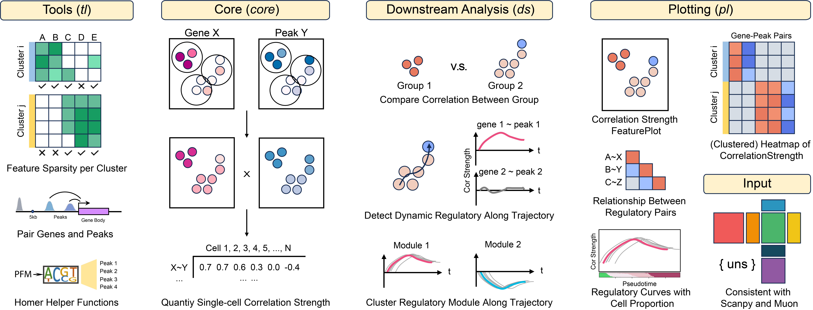

.. TREASMO documentation master file, created by
   sphinx-quickstart on Sat Nov 18 12:35:52 2023.
   You can adapt this file completely to your liking, but it should at least
   contain the root `toctree` directive.

TREASMO Documentation
===================================

TREASMO is a Transcription regulation analysis toolkit for single-cell multi-omics data. 
It quantifies the single-cell level gene-peak correlation strength, 
based on which a series of analysis and visualization functions are built to help researchers understand their multi-omics data.

      

.. toctree::
   :maxdepth: 2
   :caption: Contents:

License
-----------

TREASMO is licensed under `GPL-3.0 <https://github.com/LiuzLab/AI_MARRVEL/blob/main/LICENSE>`_.

© Copyright 2023 by Zhandong Liu's lab at Baylor College of Medicine.

.. toctree::
   :hidden:

   installation
   quickstart
   quick_start.ipynb
   api
